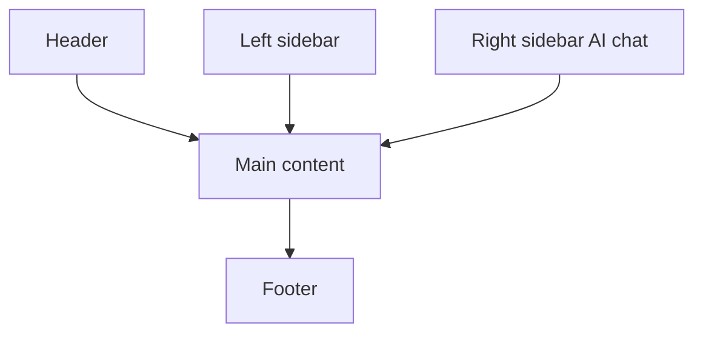

# VistaTop-Style Modern Shell for Arturo/Vista (Responsive)

## Recommendation (high level)
Build **two synchronized shells**:
1. **Vista app shell (VID)** for desktop and webview use.
2. **Static site shell (HTML/CSS)** for docs/wiki on the website.

Both share the same layout language (header, left sidebar, main content, right sidebar, footer) and visual hierarchy.

## Layout goals
- **Header**: brand, global search, primary actions.
- **Left sidebar**: navigation tree for docs/wiki/modules.
- **Main content**: pages, demos, forms, tables.
- **Right sidebar (AI Chat)**: assistant panel with prompt history and context.
- **Footer**: status, version, build info, shortcuts.

## Responsive behavior
- **Desktop**: 3-column layout + footer.
- **Tablet**: right sidebar collapses into a drawer/tab.
- **Mobile**: both sidebars become off-canvas drawers; header provides toggles.

## Suggested component set (Vista/VID)
- `app-shell` (grid container)
- `header-bar` (brand, search, actions)
- `nav-tree` (left sidebar)
- `content-pane` (main content)
- `ai-chat-pane` (right sidebar)
- `status-bar` (footer)

## Data model (minimal)
- **Navigation model** for left sidebar sections.
- **Content model** for main pane.
- **AI chat model** for right sidebar (messages, status, context).

## Workflow
- Define a reusable `vistatop` module in Vista.
- Provide hooks: `nav`, `content`, `aiChat`, `footer`.
- Mirror the same sections in the website templates.

## Implementation steps (recommended)
1. **Vista app shell (VID)**
   - Add a `vistatop` module with a grid layout and named panes.
   - Implement AI-chat pane as a reusable right sidebar component.
   - Add responsive collapse rules for sidebars.

2. **Static site shell**
   - Extend the HTML templates to include a right AI-chat panel.
   - Add CSS grid with breakpoints matching the Vista app shell.

3. **Content injection**
   - Provide `nav`, `content`, and `aiChat` blocks for each page/module.
   - Map wiki/docs into the left nav tree and main content.

4. **AI chat wiring**
   - Start with a stub UI (no backend).
   - Add API integration later with message history and streaming updates.

## Next steps
- Define the VID layout and breakpoints.
- Implement drawer behavior for sidebars.
- Add starter modules: docs viewer, wiki index, and examples list.
