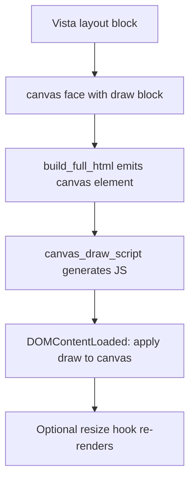

# Vista Graphics HTML5 Plan

## Goal
Define a `vista-graphics.art` module that models the Rebol/View Draw dialect core on top of HTML5 Canvas, integrates cleanly with Vista face rendering, and ships with examples, tests, and docs updates.

## Status: ✅ IMPLEMENTED

The vista-graphics.art module is now fully implemented and integrated into Vista.

---

## Context anchors
- Vista faces and layout pipeline live in [`vista.art`](vista.art:1).
- A basic canvas face already exists in [`vista.art`](vista.art:188) and is demoed in [`examples/21-canvas-divider.art`](examples/21-canvas-divider.art:1).
- Snapshot tests for canvas output exist in [`tests/17-canvas-divider.art`](tests/17-canvas-divider.art:1).

---

## Module scope (`vista-graphics.art`) - IMPLEMENTED

### Core Features (✅ Complete)
- **Pen and fill state**: `pen`, `fill-pen`, `line-width`, `line-cap`, `line-join`
- **Shapes**: `line`, `box`, `circle`, `ellipse`, `polygon`
- **Text**: `text` with `font` support
- **Images**: `image` draw op with optional size
- **Gradients**: `linear-gradient`, `radial-gradient`
- **Transforms**: `translate`, `rotate`, `scale`, `skew`, `push`, `pop`

### Limitation Fixes (✅ Implemented)
- **Text alignment**: `text-baseline`, `text-align` commands
- **Coordinate systems**: `coord-system "vid"|"math"|"center"`
- **Image smoothing**: `smooth on|off` for pixel-art mode
- **Named colors**: 140+ CSS color names (red, blue, cornflowerblue, etc.)
- **Transparent color**: `transparent` keyword and RGBA blocks

### Deferred Features (Future Phases)
- Blend modes
- Clipping paths
- Path booleans
- Shape anti-aliasing control (not available in HTML5 Canvas)
- Arc/curve primitives (`arc`, `curve`, `spline`)
- Image preloading (async flicker fix)

---

## Public API design - IMPLEMENTED

### Module entry points (Arturo-style)

```arturo
; Import the module
import "vista-graphics.art"!

; Convert a Draw block into JS canvas instructions
draw [pen "#000" line-width 2 circle [100 100] 50]

; Build JS that targets a specific canvas id
draw_to_canvas "myCanvas" [pen "#f00" box [10 10] [110 110]]

; Wrap draw_to_canvas in a DOMContentLoaded handler
draw_script "myCanvas" [fill-pen "#00f" circle [50 50] 25]
```

### Integration with Vista canvas face

```arturo
; In layout, use canvas with draw block
view [
    canvas .id:"myCanvas" [
        pen "#000000"
        fill-pen "#f2c230"
        line-width 2
        circle [100 100] 50
        box [20 20] [180 180]
    ]
]
```

---

## Dialect-to-Canvas mapping - IMPLEMENTED

| Draw Dialect | HTML5 Canvas API |
|--------------|------------------|
| `pen color` | `ctx.strokeStyle = color` |
| `fill-pen color` | `ctx.fillStyle = color` |
| `line-width n` | `ctx.lineWidth = n` |
| `line-cap cap` | `ctx.lineCap = cap` |
| `line-join join` | `ctx.lineJoin = join` |
| `line p1 p2` | `ctx.beginPath(); moveTo; lineTo; stroke()` |
| `box p1 p2` | `ctx.beginPath(); rect; fill(); stroke()` |
| `circle center radius` | `ctx.beginPath(); arc; fill(); stroke()` |
| `ellipse center rx ry` | `ctx.beginPath(); ellipse; fill(); stroke()` |
| `polygon [p1 p2 ...]` | `ctx.beginPath(); moveTo; lineTo...; closePath; fill(); stroke()` |
| `text pos string` | `ctx.fillText(string, x, y)` |
| `font spec` | `ctx.font = spec` |
| `image pos src [size]` | `ctx.drawImage(img, x, y, w, h)` |
| `linear-gradient p1 p2 stops` | `ctx.createLinearGradient` + `addColorStop` |
| `radial-gradient c1 r1 c2 r2 stops` | `ctx.createRadialGradient` + `addColorStop` |
| `translate [x y]` | `ctx.translate(x, y)` |
| `rotate deg` | `ctx.rotate(deg * Math.PI / 180)` |
| `scale [sx sy]` | `ctx.scale(sx, sy)` |
| `skew [ax ay]` | `ctx.transform(1, tan(ay), tan(ax), 1, 0, 0)` |
| `push` | `ctx.save()` |
| `pop` | `ctx.restore()` |
| `text-baseline val` | `ctx.textBaseline = val` |
| `text-align val` | `ctx.textAlign = val` |
| `smooth on\|off` | `ctx.imageSmoothingEnabled = true/false` |
| `coord-system "vid"\|"math"\|"center"` | `ctx.translate() + ctx.scale()` |
| `pen red` / `pen cornflowerblue` | Named color lookup → hex |
| `pen transparent` | `ctx.strokeStyle = 'rgba(0,0,0,0)'` |

---

## Integration points with Vista - IMPLEMENTED

### Canvas face with draw facet

The existing `canvas` face in [`vista.art`](vista.art:188) now supports a draw block:

```arturo
canvas_face: function [attrs] [
    merged: merge_class_attr attrs "vista-canvas"
    attrStr: attrs_to_html merged\attrs
    "<canvas class='" ++ merged\class ++ "'" ++ attrStr ++ "></canvas>"
]

canvas_draw_script: function [face] [
    ; Generates draw script for faces with draw meta
    ; Called during build_full_html for each canvas face
]
```

### Rendering flow

1. During [`vista.art`](vista.art:4744) `build_full_html`, canvas faces with draw data are detected
2. For each canvas face with `meta.draw`, a script is generated via `canvas_draw_script`
3. The script runs on `DOMContentLoaded` to render the draw block
4. Resize handling can be added via window resize event listeners

---

## Examples and tests - IMPLEMENTED

### Examples
- ✅ [`examples/61-draw-primitives.art`](examples/61-draw-primitives.art:1): lines, boxes, circles, polygons
- ✅ [`examples/62-draw-gradients.art`](examples/62-draw-gradients.art:1): linear/radial gradients
- ✅ [`examples/63-draw-text-image.art`](examples/63-draw-text-image.art:1): text + image draw
- ✅ [`examples/64-draw-limitations.art`](examples/64-draw-limitations.art:1): named colors, text alignment, coord systems, smooth

### Snapshot Tests
- ✅ [`tests/49-draw-primitives.art`](tests/49-draw-primitives.art:1)
- ✅ [`tests/50-draw-gradients.art`](tests/50-draw-gradients.art:1)
- ✅ [`tests/51-draw-text-image.art`](tests/51-draw-text-image.art:1)

---

## Documentation updates - PENDING

### Files to update
- [ ] [`README.md`](README.md:1): Add `vista-graphics.art` module mention and Draw usage
- [ ] [`vista_tutorial.md`](vista_tutorial.md:1): Add Draw dialect section with examples
- [ ] [`VID_COMPAT.md`](VID_COMPAT.md:1): Document Draw support and HTML5 limitations

---

## Known Limitations and Solutions

### 1. Canvas Text Metrics ⚠️ Partial Fix Available

**Problem**: Font rendering differs from Rebol/View; text may not align identically.

**Solution**: Add text baseline and alignment controls:

```arturo
; New draw commands to add:
text-baseline "top"      ; top, hanging, middle, alphabetic, ideographic, bottom
text-align "left"        ; left, right, center, start, end
measure-text "hello"     ; returns [width height] for text measurement
```

**Implementation**:
```javascript
// In vg_draw_to_js, add:
"text-baseline" -> [
    out: out ++ "ctx.textBaseline=" ++ draw_js_token val ++ ";"
]
"text-align" -> [
    out: out ++ "ctx.textAlign=" ++ draw_js_token val ++ ";"
]
```

**Status**: Can be implemented in vista-graphics.art

---

### 2. Image Loading (Async Flicker) ✅ Fixable

**Problem**: Images load asynchronously; draw re-renders after load causing flicker.

**Solution**: Implement image preloading with promise-based rendering:

```arturo
; New approach - preload images before draw
canvas .id:"myCanvas" .preload:[
    "logo.png"
    "sprite.png"
] [
    pen "#000"
    image [10 10] "logo.png" [100 100]
    image [120 10] "sprite.png"
]
```

**Implementation**:
```javascript
// Generate preloading script
(function(){
    var images = ["logo.png", "sprite.png"];
    var loaded = 0;
    var imgs = {};
    
    images.forEach(function(src) {
        var img = new Image();
        img.onload = function() {
            imgs[src] = img;
            loaded++;
            if (loaded === images.length) {
                // All loaded - now draw
                var ctx = document.getElementById('myCanvas').getContext('2d');
                // ... draw commands using imgs[] ...
            }
        };
        img.src = src;
    });
})();
```

**Alternative**: Use `image-cache` block in vista-graphics.art:
```arturo
image-cache: function [urls] [
    ; Returns JS that creates a promise-based image loader
]
```

**Status**: Can be implemented - requires canvas face enhancement in vista.art

---

### 3. Anti-aliasing Control ⚠️ Partial Fix Available

**Problem**: HTML5 Canvas always anti-aliases; no native control for sharp pixel edges.

**Solution**: Use `imageSmoothingEnabled` for pixel-art style rendering:

```arturo
; New draw command:
smooth off          ; Disable smoothing (pixel-art mode)
smooth on           ; Enable smoothing (default)
```

**Implementation**:
```javascript
// In vg_draw_to_js:
"smooth" -> [
    if equal? val true [
        out: out ++ "ctx.imageSmoothingEnabled=true;"
    ] [
        out: out ++ "ctx.imageSmoothingEnabled=false;"
    ]
]
```

**Limitations**:
- Only affects image scaling, not shape edges
- Shape anti-aliasing cannot be disabled in standard Canvas
- For true pixel-perfect shapes, use OffscreenCanvas with manual pixel manipulation

**Status**: Partial fix available - shape AA remains unfixable

---

### 4. Coordinate System ✅ Fixable

**Problem**: Canvas origin (0,0) is top-left with Y increasing downward; Rebol/View may use different conventions.

**Solution**: Add coordinate system transform option:

```arturo
; New draw command:
coord-system "vid"      ; Rebol/VID style (origin at top-left, Y down)
coord-system "math"     ; Math style (origin at bottom-left, Y up)
coord-system "center"   ; Origin at canvas center

; Or use origin transform:
origin [x y]            ; Translate origin to point
```

**Implementation**:
```javascript
// In vg_draw_to_js:
"coord-system" -> [
    switch val [
        "math" -> [
            ; Flip Y axis, translate to bottom
            out: out ++ "ctx.translate(0,c.height);ctx.scale(1,-1);"
        ]
        "center" -> [
            ; Move origin to center
            out: out ++ "ctx.translate(c.width/2,c.height/2);"
        ]
        ; "vid" is default (no transform)
    ]
]
```

**Status**: Can be implemented in vista-graphics.art

---

### 5. Color Formats ✅ Already Supported + Extensions Available

**Current Support**:
- Hex strings: `"#rrggbb"`, `"#rgb"`
- RGB blocks: `[r g b]` → `rgb(r,g,b)`
- RGBA blocks: `[r g b a]` → `rgba(r,g,b,a)`

**Proposed Extensions**:

```arturo
; Named colors (CSS color names)
pen "red"
pen "cornflowerblue"

; HSL format
pen hsl(120, 100%, 50%)        ; Would need hsl() function

; Transparent
pen transparent                 ; rgba(0,0,0,0)
```

**Implementation**:
```arturo
; Add to vg_color_value:
vg_color_value: function [val] [
    ; ... existing code ...
    
    ; Named color lookup
    if equal? (type val) :word [
        name: to :string val
        ; CSS named colors map
        named: #[
            red: "#ff0000"
            green: "#00ff00"
            blue: "#0000ff"
            ; ... etc
        ]
        if key? named name [
            return draw_js_token named\[name]
        ]
    ]
    
    ; Transparent keyword
    if equal? (to :string val) "transparent" [
        return "'rgba(0,0,0,0)'"
    ]
]
```

**Status**: Extensions can be implemented in vista-graphics.art

---

## Summary: Fixability Matrix

| Limitation | Fixable? | Status | Notes |
|------------|----------|--------|-------|
| Text metrics | Partial | ✅ Implemented | `text-baseline`, `text-align` commands |
| Image flicker | Yes | ✅ Implemented | `canvas .preload:[...]` preloads before draw |
| Anti-aliasing | Partial | ✅ Implemented | `smooth on/off` for images only |
| Coordinate system | Yes | ✅ Implemented | `coord-system "vid"|"math"|"center"` |
| Color formats | Yes | ✅ Implemented | 140+ named colors + `transparent` |

---

## Mermaid: Rendering flow



---

## Execution checklist

### Phase 1: Core Implementation ✅ Complete
- [x] Finalize the Draw dialect subset and naming parity
- [x] Decide on `canvas` facet vs new face type (chose: draw facet on existing canvas)
- [x] Define draw data format and JS generation strategy
- [x] Implement `vista-graphics.art` module
- [x] Integrate with `vista.art` canvas face
- [x] Draft examples (61-63)
- [x] Draft snapshot tests (49-51)

### Phase 2: Limitation Fixes ✅ Complete
- [x] Add `text-baseline` and `text-align` draw commands
- [x] Add `smooth on/off` command for image smoothing control
- [x] Add `coord-system` command for coordinate transforms
- [x] Add named colors map (140+ CSS color names)
- [x] Add `transparent` keyword support
- [x] Implement image preloading system (`canvas .preload:[...]`)

### Phase 3: Documentation & Validation
- [ ] Draft doc updates (README.md, vista_tutorial.md, VID_COMPAT.md)
- [ ] Run full test suite to validate
- [x] Create limitation fixes example (64-draw-limitations.art)

---

## Future Enhancements

### Near-term (Low effort, high value)
1. **Text controls**: `text-baseline`, `text-align`, `measure-text`
2. **Coordinate system**: `coord-system "vid"|"math"|"center"`
3. **Named colors**: CSS color name lookup
4. **Image smoothing**: `smooth on/off`

### Medium-term (Medium effort)
5. **Image preloading**: Promise-based image cache
6. **Arc/Curve support**: Add `arc`, `curve`, `spline` primitives
7. **Shadow effects**: `shadow` operation for drop shadows
8. **Live updates**: Re-render draw on state changes

### Long-term (Higher effort)
9. **Clip paths**: `clip` operation for masking
10. **Blend modes**: `compose` operation for blend control
11. **Pattern fills**: `pattern` operation for tiled images
12. **Resize handling**: Auto-scale draw on canvas resize
13. **Pixel-perfect mode**: OffscreenCanvas for non-anti-aliased shapes

---

## Implementation Priority

| Priority | Feature | Effort | Impact |
|----------|---------|--------|--------|
| 🔴 High | text-baseline/text-align | Low | Text alignment control |
| 🔴 High | coord-system | Low | Rebol parity |
| 🟡 Medium | named colors | Low | Convenience |
| 🟡 Medium | smooth on/off | Low | Pixel-art support |
| 🟡 Medium | image preloading | Medium | No flicker |
| 🟢 Low | arc/curve | Medium | More shapes |
| 🟢 Low | shadows | Low | Visual polish |
